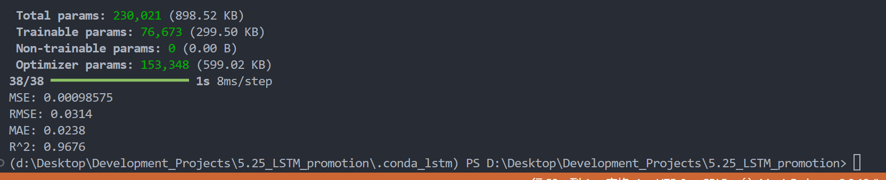
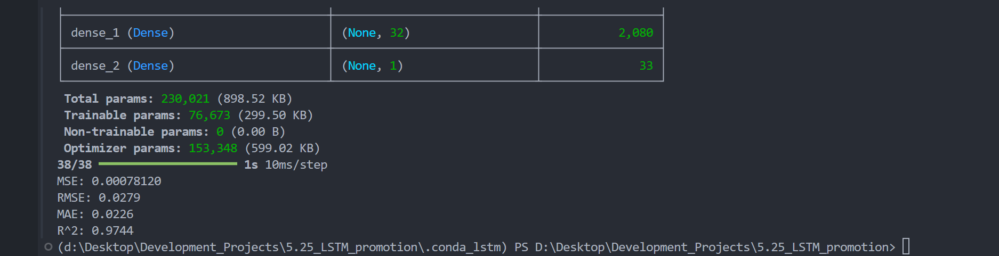

# 基于CNN和BiLSTM实现时间序列预测模型

## 简介
本项目旨在构建一个时间序列预测模型，利用卷积神经网络（CNN）和双向长短期记忆网络（BiLSTM）进行数据的预测分析。该模型通过对历史数据的学习和特征提取，预测未来的数值变化。整个项目涵盖了数据预处理、模型构建、训练与评估以及结果可视化等完整的机器学习工作流程。

## 说明
CNN+BILSTM是初期测试时做的模型，非常基础，基于Python的Keras框架，Pandas、NumPy进行数据处理和分析，Scikit-learn数据标准化(有点大材小用了),Matplotlib数据可视化，SciPy统计分析。

另外还有一个，基于Keras框架的LSTM和特征工程的模型，当时尽管试了很多办法效果还是很差，
因为特征太少，使用Scikit-learn的PolynomialFeatures生成多项式特征和交叉特征，并使用随机森林模型进行特征重要性评估，保留关键特征，
因为数据分布不均，最后使用使用Scikit-learn的train_test_split划分数据，确保训练集和测试集差异不会过大。
模型的重点有通过EarlyStopping和ReduceLROnPlateau进行学习率调整，防止过拟合和提升模型性能，同时编译模型时使用均方误差（MSE）作为损失函数。

早期做的模型，被要求使用拼音，大佬就别看啦==

## 预测模型的评估图
### 动态

### 静态


## 使用方法
1. **安装依赖**：
   ```bash
   pip install -r requirements.txt
